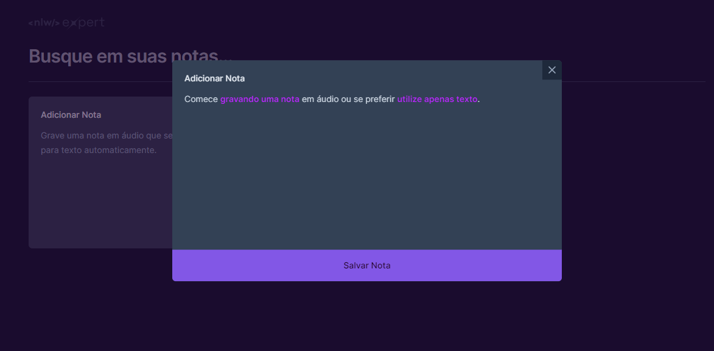

# NLW Expert (React)

  

Essa aplicação foi desenvolvida durante o NLW Experts da Rocketseat utilizando React, TypeScript, Tailwind e a SpeechRecognition API.

  

### Executando

Após clonar o repositório, acesse a pasta do projeto e execute os comandos abaixo:

~~~~
npm install
npm run dev
~~~~
Acesse http://localhost:5173 para visualizar a aplicação.

## 📝 Licença

Esse projeto está sob a licença MIT.
